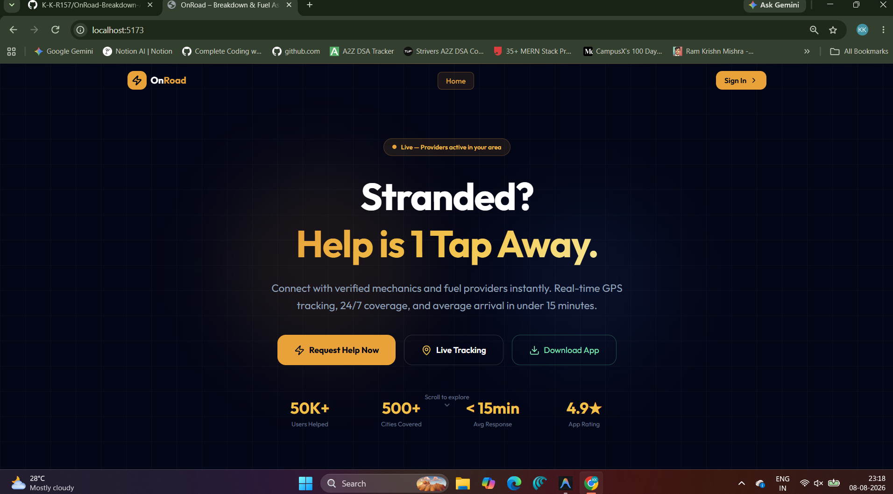
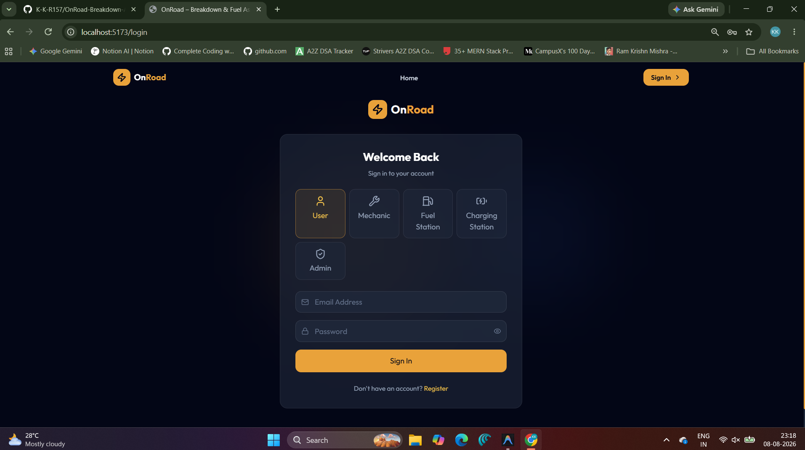
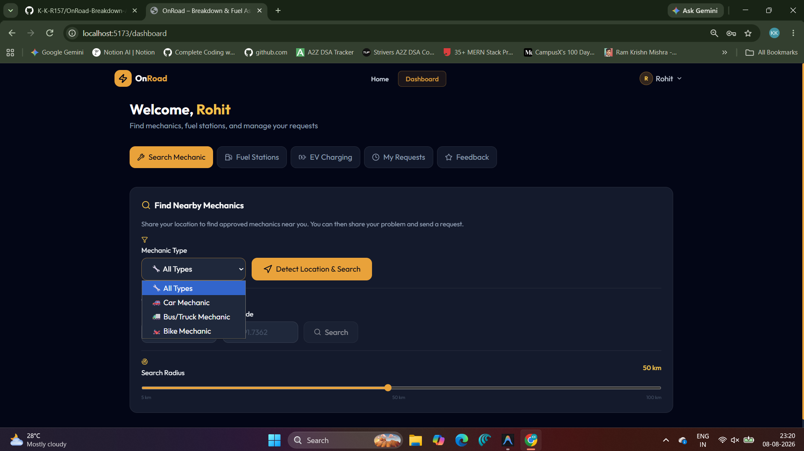
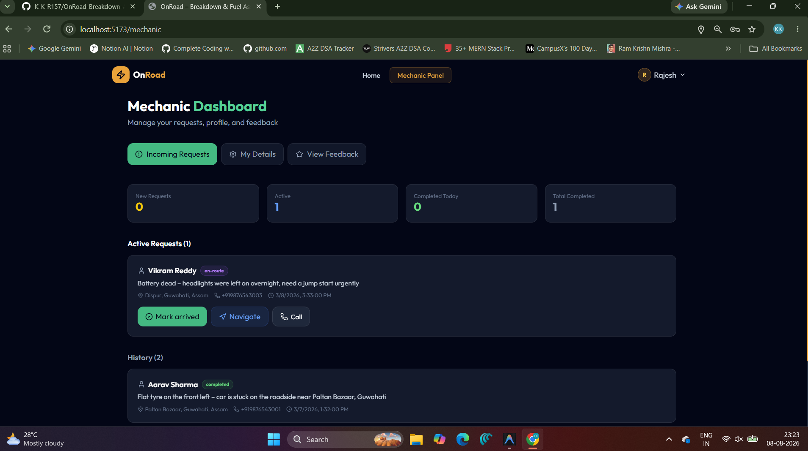
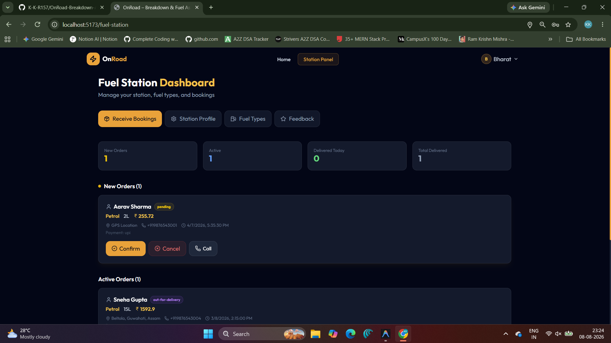
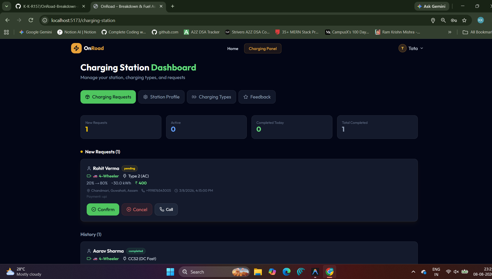
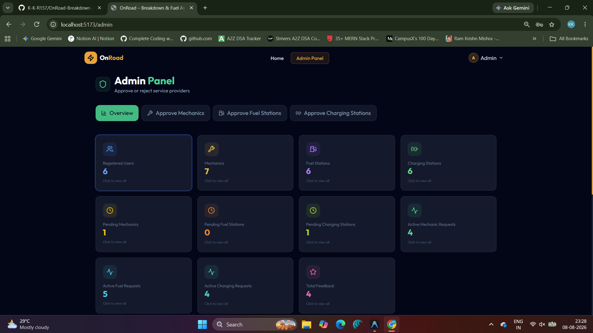
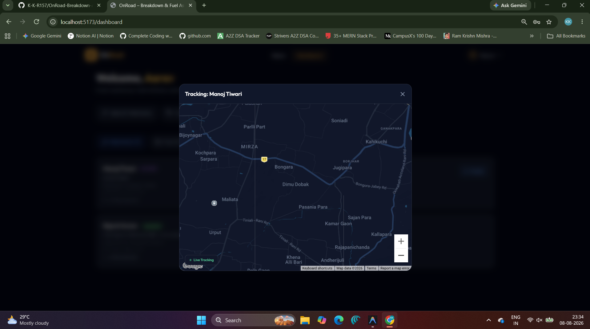

# 🚗 OnRoad Breakdown & Fuel Assistance Platform

A full-stack roadside assistance platform that connects stranded drivers with nearby mechanics, fuel stations, and EV charging stations in real time. Built with the MERN stack, a React + Vite web dashboard, and a React Native (Expo) mobile app.

---

## 📑 Table of Contents

- [Demo](#-demo)
- [Features](#-features)
- [Tech Stack](#-tech-stack)
- [Architecture](#-architecture)
- [Installation](#-installation)
- [Screenshots](#-screenshots)
- [Folder Structure](#-folder-structure)
- [API Endpoints](#-api-endpoints)
- [Future Improvements](#-future-improvements)

---

## 🎬 Demo

| Platform | URL |
|----------|-----|
| **Web (Frontend)** | `http://localhost:5173` |
| **API (Backend)** | `http://localhost:5000` |
| **Health Check** | `GET /api/health` |
| **Mobile** | Expo Go / APK build |

> **Test credentials** — Register a new account, or seed the database with `node seed.js` in the `backend/` directory to get pre-populated users, mechanics, fuel stations, and charging stations.

---

## ✨ Features

### 🔐 Authentication & Authorization
- JWT-based authentication with HTTP-only cookies
- Session management backed by MongoDB (connect-mongo)
- Role-based access control — **5 roles**: `user`, `mechanic`, `fuelStation`, `chargingStation`, `admin`
- Secure password hashing with bcrypt

### 🛠️ Mechanic Services
- Nearby mechanic search using MongoDB geospatial queries (`2dsphere` index)
- Service request workflow: `pending → accepted → en-route → arrived → in-progress → completed`
- Request cancellation support for users

### ⛽ Fuel Delivery
- Nearby fuel station discovery with geolocation
- Fuel request workflow: `pending → confirmed → preparing → out-for-delivery → delivered`
- Fuel type management (petrol, diesel, etc.)

### ⚡ EV Charging Assistance
- Nearby charging station search
- Charging request workflow with status tracking
- Charging type management (AC, DC fast-charge, etc.)

### 👑 Admin Dashboard
- Comprehensive dashboard with platform analytics (via Recharts)
- Provider approval/rejection workflow for mechanics, fuel stations, and charging stations
- Provider revocation support
- View all users, active requests, and feedback

### ⭐ Feedback & Ratings
- Users can rate and review service providers
- Providers can respond to feedback
- Helpful vote system on reviews
- Edit and update feedback

### 📡 Real-Time Features (Socket.IO)
- Live request status updates pushed to all parties
- Real-time GPS location tracking (mechanic/delivery → user)
- Bidirectional location sharing (user ↔ provider)
- Room-based communication (`role:userId` pattern)

### 📱 Cross-Platform
- Responsive web dashboard (React + Vite + Tailwind CSS)
- Native mobile app (React Native + Expo) with Google Maps integration
- Live tracking map components for both web and mobile

---

## 🧰 Tech Stack

### Backend
| Technology | Purpose |
|------------|---------|
| **Node.js** + **Express 5** | REST API server |
| **MongoDB** + **Mongoose 9** | Database & ODM |
| **Socket.IO** | Real-time bidirectional communication |
| **JWT** + **bcryptjs** | Authentication & password hashing |
| **express-session** + **connect-mongo** | Session management |
| **express-validator** | Request validation |
| **Cloudinary** + **Multer** | Image upload & cloud storage |
| **Nodemailer** | Email notifications |
| **Nodemon** | Development hot-reload |

### Frontend (Web)
| Technology | Purpose |
|------------|---------|
| **React 18** | UI library |
| **Vite 6** | Build tool & dev server |
| **Tailwind CSS 4** | Utility-first styling |
| **React Router 7** | Client-side routing |
| **Framer Motion** | Animations & transitions |
| **Recharts** | Dashboard charts & analytics |
| **Lucide React** | Icon library |
| **Socket.IO Client** | Real-time communication |
| **@react-google-maps/api** | Google Maps integration |

### Mobile
| Technology | Purpose |
|------------|---------|
| **React Native 0.81** | Cross-platform mobile framework |
| **Expo SDK 54** | Development & build toolchain |
| **React Navigation 7** | Screen navigation (native stack) |
| **React Native Maps** | Native map rendering |
| **Expo Location** | GPS / geolocation services |
| **Expo Image Picker** | Camera & gallery access |
| **AsyncStorage** | Local token persistence |
| **Socket.IO Client** | Real-time communication |

---

## 🏗️ Architecture

```
┌───────────────────────────────────────────────────────────────────┐
│                         CLIENTS                                   │
│  ┌─────────────────────┐       ┌─────────────────────────────┐   │
│  │   Web (React+Vite)  │       │  Mobile (React Native/Expo) │   │
│  │   :5173             │       │  Expo Go / APK              │   │
│  └────────┬────────────┘       └──────────┬──────────────────┘   │
└───────────┼───────────────────────────────┼───────────────────────┘
            │  HTTP / WebSocket             │  HTTP / WebSocket
            ▼                               ▼
┌───────────────────────────────────────────────────────────────────┐
│                     BACKEND (Node.js + Express)                   │
│                         :5000                                     │
│  ┌────────────┐  ┌───────────┐  ┌───────────┐  ┌─────────────┐  │
│  │   Routes   │  │Controllers│  │Middleware  │  │  Socket.IO   │  │
│  │ (7 files)  │  │ (7 files) │  │  (auth)   │  │  (realtime)  │  │
│  └─────┬──────┘  └─────┬─────┘  └─────┬─────┘  └──────┬──────┘  │
│        └───────────┬────┘              │               │         │
│                    ▼                   │               │         │
│  ┌────────────────────────────┐        │               │         │
│  │     Models (9 schemas)     │◄───────┘               │         │
│  └────────────┬───────────────┘                        │         │
└───────────────┼────────────────────────────────────────┼─────────┘
                │                                        │
                ▼                                        │
┌───────────────────────┐            ┌───────────────────┘
│    MongoDB Atlas       │            │  Real-time events:
│  ┌─────────────────┐  │            │  • request:status-updated
│  │  Users           │  │            │  • location:tracking
│  │  Mechanics       │  │            │  • location:update
│  │  FuelStations    │  │            │  • location:user-update
│  │  ChargingStations│  │            │  • join-room
│  │  MechanicRequests│  │            │
│  │  FuelRequests    │  │            ▼
│  │  ChargingRequests│  │     ┌──────────────┐
│  │  Feedback        │  │     │  Cloudinary   │
│  │  Sessions        │  │     │ (Image CDN)   │
│  └─────────────────┘  │     └──────────────┘
└───────────────────────┘
```

### Request Lifecycle

```
User creates request → Status: pending
       │
       ▼
Provider accepts → Status: accepted / confirmed
       │
       ▼
Provider en-route → Real-time GPS tracking begins
       │
       ▼
Provider arrives → Status: arrived
       │
       ▼
Work in progress → Status: in-progress / preparing
       │
       ▼
Service complete → Status: completed / delivered
       │
       ▼
User submits feedback → Rating & review stored
```

---

## 🚀 Installation

### Prerequisites

- **Node.js** ≥ 18
- **MongoDB** (local or Atlas connection string)
- **Expo CLI** (for mobile development)

### 1. Clone the Repository

```bash
git clone https://github.com/K-K-R157/OnRoad-Breakdown-And-Fuel-Assistance-Platform.git
cd OnRoad-Breakdown-And-Fuel-Assistance-Platform
```

### 2. Backend Setup

```bash
cd backend
npm install
cp .env.example .env
```

Configure `.env` with your values:

```env
PORT=5000
MONGO_URI=mongodb+srv://<user>:<pass>@cluster.mongodb.net/onroad
JWT_SECRET=your_jwt_secret
JWT_EXPIRE=7d
SESSION_SECRET=your_session_secret
SESSION_EXPIRE=86400000
NODE_ENV=development
CLIENT_URL=http://localhost:5173,http://localhost:8081
```

Start the server:

```bash
npm run dev        # Development (nodemon)
npm start          # Production
```

> **Seed data (optional):** Run `node seed.js` to populate the database with sample users, mechanics, fuel stations, and charging stations.

### 3. Frontend (Web) Setup

```bash
cd frontend
npm install
cp .env.example .env
```

Configure `.env`:

```env
VITE_API_BASE_URL=http://localhost:5000/api
```

Start the dev server:

```bash
npm run dev
```

The web app will be available at `http://localhost:5173`.

### 4. Mobile App Setup

```bash
cd mobile
npm install
```

Configure the API URL (set in `mobile/.env` or via `cross-env` in scripts):

```env
EXPO_PUBLIC_API_BASE_URL=http://<YOUR_LOCAL_IP>:5000/api
```

Start Expo:

```bash
npm start                # Default (production API)
npm run start:device     # Local network device
npm run android          # Android emulator
npm run web              # Web browser
```

---

## 📸 Screenshots

### Landing Page


### Login / Register


### User Dashboard


### Mechanic Dashboard


### Fuel Station Dashboard


### Charging Station Dashboard


### Admin Dashboard


### Live Tracking


---

## 📂 Folder Structure

```
OnRoad-Breakdown-And-Fuel-Assistance-Platform/
│
├── backend/                          # Node.js + Express REST API
│   ├── controllers/
│   │   ├── adminController.js        # Admin dashboard, approvals, revocations
│   │   ├── authController.js         # Register, login, logout, getMe
│   │   ├── chargingStationController.js  # Charging station CRUD & requests
│   │   ├── feedbackController.js     # Feedback CRUD, votes, responses
│   │   ├── fuelStationController.js  # Fuel station CRUD & requests
│   │   ├── mechanicController.js     # Mechanic CRUD & requests
│   │   └── userController.js         # User profile & request management
│   ├── middleware/
│   │   └── auth.js                   # JWT verification, role authorization
│   ├── models/
│   │   ├── User.js                   # Base user schema
│   │   ├── Mechanic.js              # Mechanic profile + geolocation
│   │   ├── FuelStation.js           # Fuel station profile + geolocation
│   │   ├── ChargingStation.js       # Charging station profile + geolocation
│   │   ├── Mechanicrequest.js       # Mechanic service request
│   │   ├── Fuelrequest.js           # Fuel delivery request
│   │   ├── ChargingRequest.js       # Charging service request
│   │   ├── BreakdownRequest.js      # General breakdown request
│   │   └── Feedback.js             # Review, rating, votes, responses
│   ├── routes/
│   │   ├── admin.js                 # /api/admin/*
│   │   ├── auth.js                  # /api/auth/*
│   │   ├── chargingStation.js       # /api/charging-stations/*
│   │   ├── feedback.js              # /api/feedback/*
│   │   ├── fuelStation.js           # /api/fuel-stations/*
│   │   ├── mechanic.js              # /api/mechanics/*
│   │   └── user.js                  # /api/users/*
│   ├── utils/
│   │   └── socketEvents.js          # Socket event constants
│   ├── seed.js                      # Database seeder script
│   ├── server.js                    # Express app + Socket.IO + MongoDB
│   ├── package.json
│   ├── .env.example
│   └── .env
│
├── frontend/                         # React + Vite web application
│   ├── src/
│   │   ├── components/
│   │   │   ├── LiveTrackingMap.jsx   # Google Maps live tracking
│   │   │   ├── Navbar.jsx           # Navigation bar
│   │   │   ├── ServiceProviderCard.jsx  # Provider listing card
│   │   │   └── StatsModal.jsx       # Statistics modal
│   │   ├── context/
│   │   │   └── AuthContext.jsx      # Authentication context provider
│   │   ├── pages/
│   │   │   ├── AdminDashboard.jsx   # Admin panel with analytics
│   │   │   ├── BreakdownForm.jsx    # Service request form
│   │   │   ├── ChargingStationDashboard.jsx  # Charging station panel
│   │   │   ├── FuelStationDashboard.jsx      # Fuel station panel
│   │   │   ├── LandingPage.jsx      # Public landing page
│   │   │   ├── LoginPage.jsx        # Auth (login/register)
│   │   │   ├── MechanicDashboard.jsx # Mechanic panel
│   │   │   ├── TrackingDashboard.jsx # Live tracking view
│   │   │   └── UserDashboard.jsx    # User service panel
│   │   ├── utils/
│   │   │   └── api.js               # Axios/fetch API client
│   │   ├── App.jsx                  # Root component + routing
│   │   ├── main.jsx                 # React entry point
│   │   └── styles.css               # Global styles
│   ├── public/
│   ├── index.html
│   ├── vite.config.js
│   ├── vercel.json                  # Vercel deployment config
│   ├── package.json
│   ├── .env.example
│   └── .env
│
├── mobile/                           # React Native + Expo mobile app
│   ├── src/
│   │   ├── components/
│   │   │   ├── LiveTrackingMap.js    # Native map tracking (Android/iOS)
│   │   │   ├── LiveTrackingMap.web.js # Web fallback map
│   │   │   ├── TrackingModal.js     # Tracking overlay modal
│   │   │   ├── theme.js             # Design tokens & colors
│   │   │   └── ui.js                # Reusable UI primitives
│   │   ├── context/
│   │   │   ├── AuthContext.js       # Auth state + AsyncStorage
│   │   │   └── SocketContext.js     # Socket.IO connection manager
│   │   ├── screens/
│   │   │   ├── AuthScreen.js        # Login & registration
│   │   │   ├── HomeScreen.js        # Role-based home router
│   │   │   ├── RoleHomeScreen.js    # Provider dashboards
│   │   │   └── UserHomeScreen.js    # User service screen
│   │   └── services/
│   │       ├── api.js               # HTTP API client
│   │       └── trackingService.js   # GPS tracking utilities
│   ├── assets/                      # App icons & splash screen
│   ├── App.js                       # Root component
│   ├── index.js                     # Entry point
│   ├── app.json                     # Expo config
│   ├── app.config.js                # Dynamic Expo config
│   ├── eas.json                     # EAS Build config
│   ├── package.json
│   └── .env
│
├── screenshots/                      # Application screenshots
│   ├── landing-page.png             # Landing page
│   ├── login.png                    # Login / register page
│   ├── user.png                     # User dashboard
│   ├── mechanic.png                 # Mechanic dashboard
│   ├── fuel_station.png             # Fuel station dashboard
│   ├── charging_station.png         # Charging station dashboard
│   ├── Admin.png                    # Admin dashboard
│   └── live_tracking.png            # Live GPS tracking view
│
├── .github/workflows/               # CI/CD pipelines
├── .gitignore
└── README.md
```

---

## 🔌 API Endpoints

Base URL: `http://localhost:5000/api`

### Authentication (`/api/auth`)

| Method | Endpoint | Auth | Description |
|--------|----------|------|-------------|
| `POST` | `/auth/register` | ❌ | Register a new user (any role) |
| `POST` | `/auth/login` | ❌ | Login and receive JWT |
| `GET` | `/auth/logout` | ❌ | Clear session & logout |
| `GET` | `/auth/me` | 🔒 | Get current authenticated user |

### User Routes (`/api/users`)
_Requires: `user` or `admin` role_

| Method | Endpoint | Description |
|--------|----------|-------------|
| `GET` | `/users/me` | Get user profile |
| `PUT` | `/users/me` | Update user profile |
| `POST` | `/users/requests/mechanic` | Create a mechanic request |
| `GET` | `/users/requests/mechanic` | List my mechanic requests |
| `PATCH` | `/users/requests/mechanic/:id/cancel` | Cancel a mechanic request |
| `POST` | `/users/requests/fuel` | Create a fuel delivery request |
| `GET` | `/users/requests/fuel` | List my fuel requests |
| `PATCH` | `/users/requests/fuel/:id/cancel` | Cancel a fuel request |
| `POST` | `/users/requests/charging` | Create a charging request |
| `GET` | `/users/requests/charging` | List my charging requests |
| `PATCH` | `/users/requests/charging/:id/cancel` | Cancel a charging request |

### Mechanic Routes (`/api/mechanics`)
_Requires: `mechanic` role (except `/nearby`)_

| Method | Endpoint | Auth | Description |
|--------|----------|------|-------------|
| `GET` | `/mechanics/nearby` | ❌ | Search nearby mechanics (geospatial) |
| `GET` | `/mechanics/me` | 🔒 | Get mechanic profile |
| `PUT` | `/mechanics/me` | 🔒 | Update mechanic profile |
| `GET` | `/mechanics/requests` | 🔒 | List incoming requests |
| `PATCH` | `/mechanics/requests/:id/status` | 🔒 | Update request status |
| `GET` | `/mechanics/stats` | 🔒 | Get mechanic statistics |

### Fuel Station Routes (`/api/fuel-stations`)
_Requires: `fuelStation` role (except `/nearby`)_

| Method | Endpoint | Auth | Description |
|--------|----------|------|-------------|
| `GET` | `/fuel-stations/nearby` | ❌ | Search nearby fuel stations |
| `GET` | `/fuel-stations/me` | 🔒 | Get fuel station profile |
| `PUT` | `/fuel-stations/me` | 🔒 | Update fuel station profile |
| `PATCH` | `/fuel-stations/fuel-types` | 🔒 | Update available fuel types |
| `GET` | `/fuel-stations/requests` | 🔒 | List incoming requests |
| `PATCH` | `/fuel-stations/requests/:id/status` | 🔒 | Update request status |
| `GET` | `/fuel-stations/stats` | 🔒 | Get fuel station statistics |

### Charging Station Routes (`/api/charging-stations`)
_Requires: `chargingStation` role (except `/nearby`)_

| Method | Endpoint | Auth | Description |
|--------|----------|------|-------------|
| `GET` | `/charging-stations/nearby` | ❌ | Search nearby charging stations |
| `GET` | `/charging-stations/me` | 🔒 | Get charging station profile |
| `PUT` | `/charging-stations/me` | 🔒 | Update charging station profile |
| `PATCH` | `/charging-stations/charging-types` | 🔒 | Update charger types |
| `GET` | `/charging-stations/requests` | 🔒 | List incoming requests |
| `PATCH` | `/charging-stations/requests/:id/status` | 🔒 | Update request status |
| `GET` | `/charging-stations/stats` | 🔒 | Get charging station statistics |

### Admin Routes (`/api/admin`)
_Requires: `admin` role_

| Method | Endpoint | Description |
|--------|----------|-------------|
| `GET` | `/admin/dashboard` | Platform analytics & stats |
| `GET` | `/admin/me` | Admin profile |
| `PUT` | `/admin/me` | Update admin profile |
| `GET` | `/admin/users` | List all users |
| `GET` | `/admin/mechanics/pending` | List pending mechanic registrations |
| `GET` | `/admin/mechanics/all` | List all mechanics |
| `PATCH` | `/admin/mechanics/:id/review` | Approve/reject mechanic |
| `PATCH` | `/admin/mechanics/:id/revoke` | Revoke mechanic access |
| `GET` | `/admin/fuel-stations/pending` | List pending fuel stations |
| `GET` | `/admin/fuel-stations/all` | List all fuel stations |
| `PATCH` | `/admin/fuel-stations/:id/review` | Approve/reject fuel station |
| `PATCH` | `/admin/fuel-stations/:id/revoke` | Revoke fuel station access |
| `GET` | `/admin/charging-stations/pending` | List pending charging stations |
| `GET` | `/admin/charging-stations/all` | List all charging stations |
| `PATCH` | `/admin/charging-stations/:id/review` | Approve/reject charging station |
| `PATCH` | `/admin/charging-stations/:id/revoke` | Revoke charging station access |
| `GET` | `/admin/mechanic-requests/active` | Active mechanic requests |
| `GET` | `/admin/fuel-requests/active` | Active fuel requests |
| `GET` | `/admin/charging-requests/active` | Active charging requests |
| `GET` | `/admin/feedback/all` | All platform feedback |

### Feedback Routes (`/api/feedback`)

| Method | Endpoint | Auth | Description |
|--------|----------|------|-------------|
| `GET` | `/feedback/provider/:providerId` | ❌ | Get feedback for a provider |
| `POST` | `/feedback` | 🔒 `user` | Create feedback |
| `PUT` | `/feedback/:id` | 🔒 `user` | Update feedback |
| `GET` | `/feedback/me` | 🔒 `user` | Get my submitted feedback |
| `POST` | `/feedback/:id/helpful` | 🔒 | Toggle helpful vote |
| `POST` | `/feedback/:id/respond` | 🔒 `provider` | Respond to feedback |

### Socket.IO Events

| Event | Direction | Description |
|-------|-----------|-------------|
| `join-room` | Client → Server | Join a role-based room (`role:userId`) |
| `location:update` | Provider → Server | Broadcast GPS coordinates |
| `location:tracking` | Server → User | Receive provider's live location |
| `location:share-user` | User → Server | Share location with mechanic |
| `location:share-user-fuel` | User → Server | Share location with fuel station |
| `location:share-user-charging` | User → Server | Share location with charging station |
| `location:user-update` | Server → Provider | Receive user's live location |
| `request:status-updated` | Server → Client | Status change notification |

---

## 🔮 Future Improvements

- [ ] **Payment Integration** — Razorpay / Stripe for in-app payments and invoicing
- [ ] **Push Notifications** — FCM (Firebase Cloud Messaging) for mobile alerts
- [ ] **Email Verification** — OTP-based email verification on registration
- [ ] **Advanced Geofencing** — Auto-detect service coverage areas and notify providers
- [ ] **Driver SOS Button** — One-tap emergency request with auto-location
- [ ] **Service Price Estimation** — Upfront cost estimates before confirming a request
- [ ] **Provider Availability Scheduling** — Operating hours and calendar-based availability
- [ ] **Chat System** — In-app messaging between users and service providers
- [ ] **Multi-Language Support** — i18n for regional language localization
- [ ] **Analytics Dashboard V2** — Revenue tracking, heatmaps, and trend analysis
- [ ] **Rate Limiting & Throttling** — API rate limiting for production security
- [ ] **Automated Testing** — Unit & integration test suites (Jest, Supertest)
- [ ] **Docker Compose** — One-command dev environment setup
- [ ] **CI/CD Pipeline** — Automated testing and deployment via GitHub Actions
- [ ] **PWA Support** — Installable progressive web app with offline caching

---

## 📝 Notes

- The first admin account can be created by registering with role `admin`.
- Mechanic, fuel station, and charging station logins are blocked until admin approval.
- The backend supports multiple CORS origins via comma-separated `CLIENT_URL` in `.env`.
- Mobile app uses `cross-env` to inject the API base URL at startup.

---

## 📄 License

This project is licensed under the ISC License.
